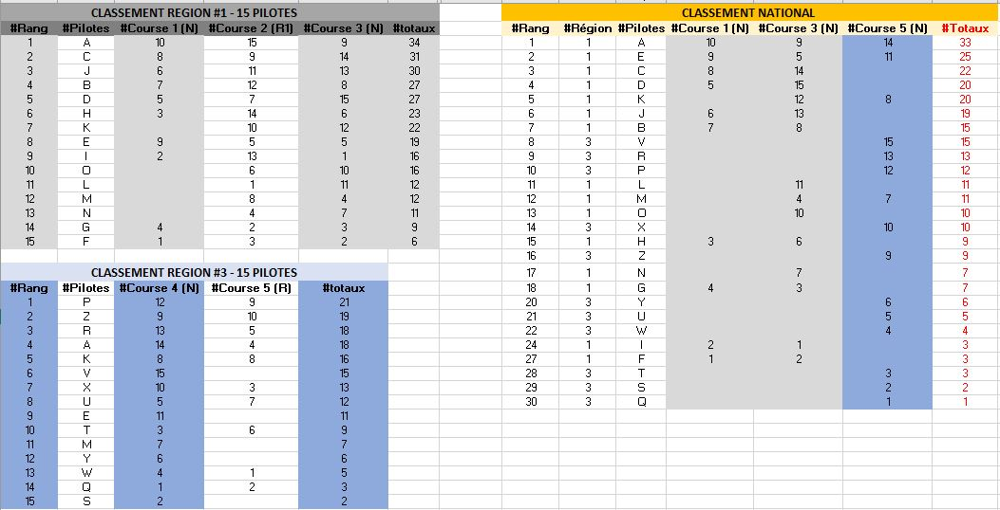

# REGLEMENT DRONE RACING

<!-- TOC -->

- [REGLEMENT](#reglement)
  - [2 formats de courses](#2-formats-de-courses)
    - [Propositions](#proposition)
  - [Format des courses nationales](#format-des-courses-nationale)
  - [Format des courses régionales](#format-des-courses-régionale)
  - [Définition des régions](#définition-des-régions)
  - [Attribution des points pour les différents classement](#attribution-des-points-pour-les-différents-classement)
    - [Courses FFAM](#courses-ffam)
      - [Exemple pour une course à 32 pilotes](#exemple-pour-une-course-à-32-pilotes)
      - [Exemple pour une course à 16 pilotes](#exemple-pour-une-course-à-16-pilotes)
    - [Courses FAI](#courses-fai)
  - [Mode de sélection au Championnat de France](#mode-de-sélection-au-championnat-de-france)
  - [Saison de référence](#saison-de-référence)
  - [Critères pour organiser le Championnat de France](#critères-pour-organiser-le-championnat-de-france)
  - [Mode de sélection pour l'équipe de France](#mode-de-sélection-pour-léquipe-de-france)

<!-- /TOC -->

## 2 formats de courses (je mettrai 2 types de courses)

- National
- Régional

Les courses nationales et régionales sont des courses officielles, comptant pour les [critères organisateurs pour le Championnat de France](#critere-pour-organiser-le-championnat-de-france).

### Proposition

> Pour les courses nationales licence ou passeport compétition obligatoire ?

> Pour les courses regionales licence ou passeport loisir accepté ?

> Pour participer au Championnat de France en cas de sélection : Licence compétition obligatoire ?

## Format des courses nationales

> Comptant pour le classement national et régional.

- 16 participants minimum (Pour info la moyenne des participants sur la saison 2019 est de 25 pilotes sur 18 courses)
-	Respect du réglement FAI
-	Chronométrage/Système de course homologué ? (definir un protocol d'homologation)
- Déclaration des courses sur portail FFAM 30 jours avant le début de l'évènement.
- Mutlirotor avec une taille d'hélice supérieur ou égale à 3 pouces.

> Objectif : Harmoniser l'organisation au maximum. Favoriser la compétition. Les courses devront être clairement identifiées comme comptant pour le classement national.

## Format des courses régionales

> Comptant uniquement pour le classement régional.

-	[Règlement à point](reglement-a-point.md) (montée/descente) pour favoriser les vols.

> Objectif : Faciliter l'accès aux pilotes "amateurs" et/ou qui ne souhaite pas se déplacer sur de longue distance. Favoriser la découverte de la compétition dans un cadre plus agréable.

## Définition des régions

Le découpage des indicatifs téléphonique peut être une bonne base de départ, soit un découpage en 5 régions.


## Attribution des points pour les différents classements

### Courses FFAM

Toutes les courses sont au minimum des courses régionales, mais celles qui respectent le cahier des charges deviennent éligibles pour compter au classement national.

La zone d'attribution des points est établi par la zone géographique de l'évènement. Exemple : Si vous participez à une course organisée à Rennes par un club Parisien, vos points seront attribués à la region Bretagne (02).

```Plus de limite à 20 points mais aux nombres de pilotes présent à la course.``` (Cela rendra les courses a peu de participants peu intérésente)

#### Exemple pour une course à 32 pilotes

PLACE | 1 | 2 | 3 | 4 | 5 | ... | 30 | 31 | 32
-- | -- | -- | -- | -- | -- | -- | -- | -- | --
POINTS | 32 | 31 | 30 | 29| 28 | ... | 3 | 2 | 1

#### Exemple pour une course à 16 pilotes

PLACE | 1 | 2 | 3 | 4 | 5 | ... | 14 | 15 | 16
-- | -- | -- | -- | -- | -- | -- | -- | -- | --
POINTS | 16 | 15 | 14 | 13| 12 | ... | 3 | 2 | 1

**Attention : Les pilotes non qualifiés doivent également être présent dans le classement, en les classant par leur résultat en qualification.**

> Le classement de chaque course devra être communiqué à la fédération en remplissant le fichier suivant : [template-classement.csv](fichiers/template-classement.csv).

### Courses FAI

*Faire des propositions, sinon on reste sur le même principe de points que les courses FFAM.*

## Mode de sélection au Championnat de France

- 40 premiers pilotes du classement National
- 5 premiers pilotes de chaque classement Regional, qui ne sont pas déjà éligible via le classement National

Soit un total de 65 pilotes éligibles au Championnat de France.

> Plus de limite haute ou basse aux nombres de participations, toutes les participations comptent dans les differents classement.

> Les classements ce font aux nombres de points, puis aux nombres de participations, puis par ordre alphabetique du nom de famille.


_vous pouvez télécharger le fichier excel ici [classement régional national](fichiers/classement_regional_national.xlsx)_

> Proposition de Bonus : A chaque nouvelle region, le pilote prend +5 pts de bonus par région, au classement national -> favoriser le déplacement inter-région

## Saison de référence

Du lendemain du dernier week-end de juillet année N, au dernier week-end, inclus de juillet année N+1.

Exemple : Pour la saison 2020, du lundi 29 juillet 2019, au dimanche 26 juillet 2020.

## Critères pour organiser le Championnat de France

- Etre un club affilié depuis la saison précédente au minimum.
- Avoir organisé au moins 3 courses officielles.
- Application du Réglement FAI
- 32 participants minimum
- 65 participants maximum (cf. [mode de selection au CdF](#mode-de-selection-au-championnat-de-france))  
- Facilité d'accès en transport
- Proche hôtellerie et restauration
- Ouvert au public
- Organiser entre septembre et octobre
- Ouverture des inscriptions au plus tard mi-aout
- Le lieu et la date doivent etre connu a mi-saison

## Mode de sélection pour l'équipe de France

La sélection ce fait uniquement dans le classement national auprès des pilotes possédant une licence compétition.

>Proposition 1 : Prendre les 2 meilleurs Adultes (plus de 18ans) et les 2 meilleurs Juniors (- de 18ans) du classement national.

>Proposition 2 : 4 premiers du classement national.

>Proposition 3 : Avoir une licence FAI, avoir participer à x courses FAI dont X à l'étranger et selectionner les mieux classés (peut etre retenir les x meilleurs classements afin de ne pas favoriser les plus fortuner)
