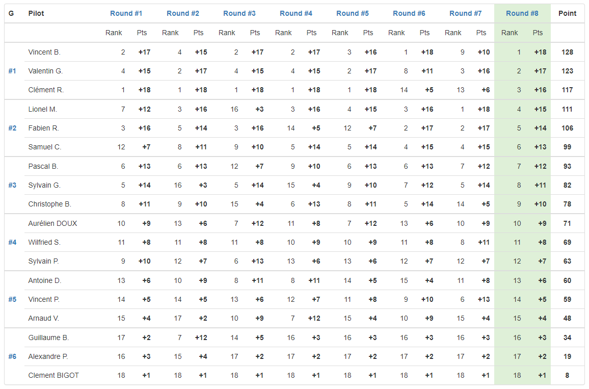

# Réglement à point

<!-- TOC -->

- [Réglement à point](#réglement-à-point)
  - [Présention](#présention)
  - [Nombre de participant](#nombre-de-participant)
  - [Qualification](#qualification)
  - [Compétition : Les manches](#compétition--les-manches)
  - [Classement final](#classement-final)
  - [Exemple de tableau](#exemple-de-tableau)

<!-- /TOC -->

## Présention

Le réglement à point a pour objectif de favoriser le nombre de vol, en permettant à tous les participants d'effectuer le même nombre de vols. Pour garder l'aspect compétition un systeme de point permet de monter/descendre dans le classement, et de toujours concourrir contre des pilotes ayant le meme niveau de pilotage.

## Nombre de participant

Aucune limite minimum et/ou maximum de participant n'est défini. C'est au choix de l'organisateur.

## Qualification

1 seule manche qualificative, avec 4 pilotes par poules.
A l'issue de cette manche un classement est établi en fonction des chronos de chacun.
Les 4 premiers se retrouvent dans le poule 1, les 4 suivants dans la 2, etc...

Le classement peut s'etablir au meilleur temps, au 2 meilleurs temps ou au 3 meilleurs temps. C'est au choix de l'organisateur.

> Il correspond à peu près à un classement par niveau mais il s'affinera par la suite. Cela permettra aussi de voler avec des pilotes de même niveau tout au long de la compétition.

## Compétition : Les manches

La compétition est comsposée de plusieurs manches, celle-ci peuvent être illimité.

> Attention : Toute manche commencée doit etre finie.

Une manche se décompose en X groupe de 4 pilotes. Exemple : 16 pilotes soit 4 groupes de 4 pilotes.

#### Exemple pour une course à 16 pilotes :

-| PILOTES | - | - | -
-- | -- | -- | -- | --
POULE A | 1 | 2 | 3 | 4
POULE B | 5 | 6 | 7 | 8
POULE C | 9 | 10 | 11 | 12
POULE D | 13 | 14 | 15 | 16

La première manche est défini en fonction du classement de qualification.

Les manches suivantes se feront en fonction des points de chaque pilote.

A l'issue de chaque manche les pilotes seront classés en fonction de leur chrono, tous groupes confondu. Un nombre de points leur sera alors attribué en fonction du nombre de pilote et de leur position dans le classement de cette manche. En cas d'égalité les pilotes seront départagés par leur classement en début de manche.

> Exemple : Pilote X fini 1er sur 16 pilotes, il gagne 16pts. Pilote Y fini 2éme sur 16 pilotes il gagne 15pts, et ainsi de suite.

> Exemple en cas d'égalité : Pilote X fini dernier ex aequo avec pilote Y. Si pilote X était 3ème au classement en debut de manche, et pilote Y 7ème. Le classement final pour Pilote X sera 15éme et pour Pilote Y 16éme.

Ces points viennent s'additionner aux nombres de points accumulés sur les manches précédentes, et permettent une ré-attribution des pilotes dans chaque groupe en fonction de leur total de points accumulés.

## Classement final

Chaque pilote accumule des points entre chaque manche.

Le classement final est établi sur le total de ces points, du plus grand nombre de points au plus petit nombre.

## Exemple de tableau

Vous pouvez également consulter cet exemple de course : https://www.rotormatch.com/events/349-smr-cup-indoor-2-tiny-racer/races
